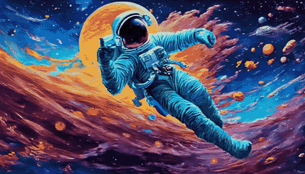

# A beta-version of motion module for SDXL

Now you can generate high-resolution videos on SDXL **with/without** personalized models. Checkpoint with better quality would be available soon. Stay tuned.

## Somethings Important
- Generate videos with high-resolution (we provide recommended ones) as SDXL usually leads to worse quality for low-resolution images.
- Quality strongly depends on the sampler and #sampling stepes (we use EulerDiscrete sampler for 100 steps). Be careful. 
- Follow and slightly adjust the hyperparameters (e.g., #sampling steps, #guidance scale) of various personalized SDXL since these models are carefully tuned to various extent.

## Model Zoo
<details open>
<summary>Motion Modules</summary>

  | Name                 | Parameter | Storage Space |
  |----------------------|-----------|---------------|
  | mm_sdxl_v10_beta.ckpt      | 238 M     | 0.9 GB        |

</details>

<details open>
<summary>Recommended Resolution</summary>

  | Resolution                 | Aspect Ratio | 
  |----------------------|-----------|
  | 768x1344      | 9:16     |
  | 832x1216      | 2:3     |
  | 1024x1024     | 1:1     |
  | 1216x832      | 3:2     |
  | 1344x768      | 16:9     |

</details>

## Gallery
We demonstrate some results with our model. The GIFs below are **manually downsampled** after generation for fast loading. 

**Original SDXL**
<table class="center">
    <tr>
    <td></td>
    <td></td>
    </tr>
</table>

**LoRA**
<table class="center">
    <tr>
    <td></td>
    <td></td>
    <td></td>
    </tr>
</table>
<p style="margin-left: 2em; margin-top: -1em">Model：<a href="https://civitai.com/models/122606?modelVersionId=169718">DynaVision</a><p>

<table class="center">
    <tr>
    <td></td>
    <td></td>
    </tr>
</table>
<p style="margin-left: 2em; margin-top: -1em">Model：<a href="https://civitai.com/models/112902/dreamshaper-xl10?modelVersionId=126688">DreamShaper</a><p>
<table class="center">
    <tr>
    <td></td>
    <td></td>
    <td></td>
    </tr>
</table>
<p style="margin-left: 2em; margin-top: -1em">Model：<a href="https://civitai.com/models/128397/deepblue-xl?modelVersionId=189102">DeepBlue</a><p>


## Inference Example

Inference at recommended resolution of 16 frames usually requires ~13GB VRAM.
### Step-1: Prepare Environment

```
git clone https://github.com/guoyww/AnimateDiff.git
cd AnimateDiff
git checkout sdxl


conda env create -f environment.yaml
conda activate animatediff_xl
```

### Step-2: Download Base T2I & Motion Module Checkpoints
We provide a beta version of motion module on SDXL. You can download the base model of SDXL 1.0 and Motion Module following instructions below.
```
git lfs install
git clone https://huggingface.co/stabilityai/stable-diffusion-xl-base-1.0 models/StableDiffusion/

bash download_bashscripts/0-MotionModule.sh
```
You may also directly download the motion module checkpoints from [Google Drive](https://drive.google.com/file/d/1EK_D9hDOPfJdK4z8YDB8JYvPracNx2SX/view?usp=share_link
) / [HuggingFace](https://huggingface.co/guoyww/animatediff/blob/main/mm_sdxl_v10_beta.ckpt
) / [CivitAI](https://civitai.com/models/108836/animatediff-motion-modules), then put them in `models/Motion_Module/` folder.

###  Step-3: Download Personalized SDXL (you can skip this if generating videos on the original SDXL)
You may run the following bash scripts to download the LoRA checkpoint from CivitAI.
```
bash download_bashscripts/1-DynaVision.sh
bash download_bashscripts/2-DreamShaper.sh
bash download_bashscripts/3-DeepBlue.sh
```

### Step-4: Generate Videos
Run the following commands to generate videos of **original SDXL**. 
```
python -m scripts.animate --exp_config configs/prompts/1-original_sdxl.yaml --H 1024 --W 1024 --L 16 --xformers
```
Run the following commands to generate videos of **personalized SDXL**. DO NOT skip Step-3.
```
python -m scripts.animate --config configs/prompts/2-DynaVision.yaml --H 1024 --W 1024 --L 16 --xformers
python -m scripts.animate --config configs/prompts/3-DreamShaper.yaml --H 1024 --W 1024 --L 16 --xformers
python -m scripts.animate --config configs/prompts/4-DeepBlue.yaml --H 1024 --W 1024 --L 16 --xformers
```
The results will automatically be saved to `samples/` folder.


## Customized Inference 
To generate videos with a new Checkpoint/LoRA model, you may create a new config `.yaml` file in the following format:
```

motion_module_path: "models/Motion_Module/mm_sdxl_v10_beta.ckpt" # Specify the Motion Module

# We support 3 types of T2I models. 
  # 1. Checkpoint: a safetensors model contains UNet, Text_Encoders, VAE.
  # 2. LoRA: a safetensors model contains only the LoRA modules. 
  # 3. You can convert the Checkpoint into a folder with the same structure as SDXL_1.0 base model.
  

ckpt_path: "YOUR_CKPT_PATH" # path to the checkpoint type model from CivitAI.
lora_path: "YOUR_LORA_PATH" # path to the LORA type model from CivitAI.
base_model_path: "YOUR_BASE_MODEL_PATH" # path to the folder converted from a checkpoint


steps:          50
guidance_scale: 8.5

seed: -1 # You can specify seed for each prompt.

prompt:
  - "[positive prompt]"

n_prompt:
  - "[negative prompt]"
```

Then run the following commands. 
```
python -m scripts.animate --exp_config [path to the personalized config] --L [video frames] --H [Height of the videos] --W [Width of the videos] --xformers
```
