# AnimateDiff

This repository is the official implementation of [AnimateDiff](https://arxiv.org/abs/2307.04725) [ICLR2024 Spotlight].
It is a plug-and-play module turning most community text-to-image models into animation generators, without the need of additional training.

**[AnimateDiff: Animate Your Personalized Text-to-Image Diffusion Models without Specific Tuning](https://arxiv.org/abs/2307.04725)** 
</br>
[Yuwei Guo](https://guoyww.github.io/),
[Ceyuan Yang✝](https://ceyuan.me/),
[Anyi Rao](https://anyirao.com/),
[Zhengyang Liang](https://maxleung99.github.io/),
[Yaohui Wang](https://wyhsirius.github.io/),
[Yu Qiao](https://scholar.google.com.hk/citations?user=gFtI-8QAAAAJ),
[Maneesh Agrawala](https://graphics.stanford.edu/~maneesh/),
[Dahua Lin](http://dahua.site),
[Bo Dai](https://daibo.info)
(✝Corresponding Author)  
[](https://arxiv.org/abs/2307.04725)
[](https://animatediff.github.io/)
[](https://openxlab.org.cn/apps/detail/Masbfca/AnimateDiff)
[](https://huggingface.co/spaces/guoyww/AnimateDiff)

***Note:*** The `main` branch is for [Stable Diffusion V1.5](https://huggingface.co/runwayml/stable-diffusion-v1-5); for [Stable Diffusion XL](https://huggingface.co/stabilityai/stable-diffusion-xl-base-1.0), please refer `sdxl-beta` branch.


## Quick Demos
More results can be found in the [Gallery](__assets__/docs/gallery.md).
Some of them are contributed by the community.

<table class="center">
    <tr>
    <td></td>
    <td>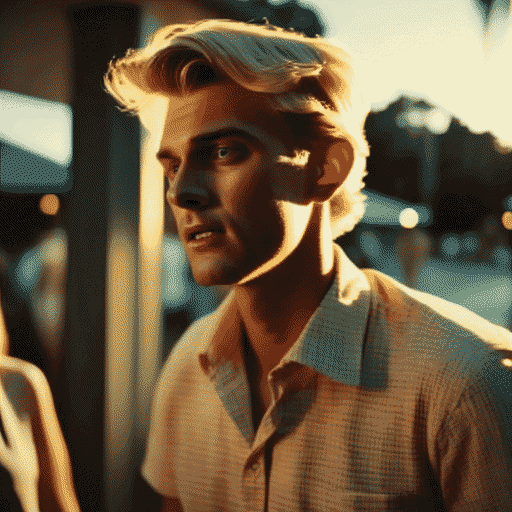</td>
    <td></td>
    <td></td>
    </tr>
</table>
<p style="margin-left: 2em; margin-top: -1em">Model：<a href="https://civitai.com/models/30240/toonyou">ToonYou</a></p>

<table>
    <tr>
    <td>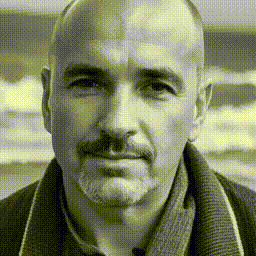</td>
    <td></td>
    <td></td>
    <td>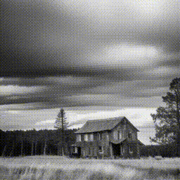</td>
    </tr>
</table>
<p style="margin-left: 2em; margin-top: -1em">Model：<a href="https://civitai.com/models/4201/realistic-vision-v20">Realistic Vision V2.0</a></p>


## Quick Start
***Note:*** AnimateDiff is also offically supported by Diffusers.
Visit [AnimateDiff Diffusers Tutorial](https://huggingface.co/docs/diffusers/api/pipelines/animatediff) for more details.
*Following instructions is for working with this repository*.

***Note:*** For all scripts, checkpoint downloading will be *automatically* handled, so the script running may take longer time when first executed.

### 1. Setup repository and environment

```
git clone https://github.com/guoyww/AnimateDiff.git
cd AnimateDiff

pip install -r requirements.txt
```

### 2. Launch the sampling script!
The generated samples can be found in `samples/` folder.

#### 2.1 Generate animations with comunity models
```
python -m scripts.animate --config configs/prompts/1_animate/1_1_animate_RealisticVision.yaml
python -m scripts.animate --config configs/prompts/1_animate/1_2_animate_FilmVelvia.yaml
python -m scripts.animate --config configs/prompts/1_animate/1_3_animate_ToonYou.yaml
python -m scripts.animate --config configs/prompts/1_animate/1_4_animate_MajicMix.yaml
python -m scripts.animate --config configs/prompts/1_animate/1_5_animate_RcnzCartoon.yaml
python -m scripts.animate --config configs/prompts/1_animate/1_6_animate_Lyriel.yaml
python -m scripts.animate --config configs/prompts/1_animate/1_7_animate_Tusun.yaml
```

#### 2.2 Generate animation with MotionLoRA control
```
python -m scripts.animate --config configs/prompts/2_motionlora/2_motionlora_RealisticVision.yaml
```

#### 2.3 More control with SparseCtrl RGB and sketch
```
python -m scripts.animate --config configs/prompts/3_sparsectrl/3_1_sparsectrl_i2v.yaml
python -m scripts.animate --config configs/prompts/3_sparsectrl/3_2_sparsectrl_rgb_RealisticVision.yaml
python -m scripts.animate --config configs/prompts/3_sparsectrl/3_3_sparsectrl_sketch_RealisticVision.yaml
```

#### 2.4 Gradio app
We created a Gradio demo to make AnimateDiff easier to use. 
By default, the demo will run at `localhost:7860`.
```
python -u app.py
```
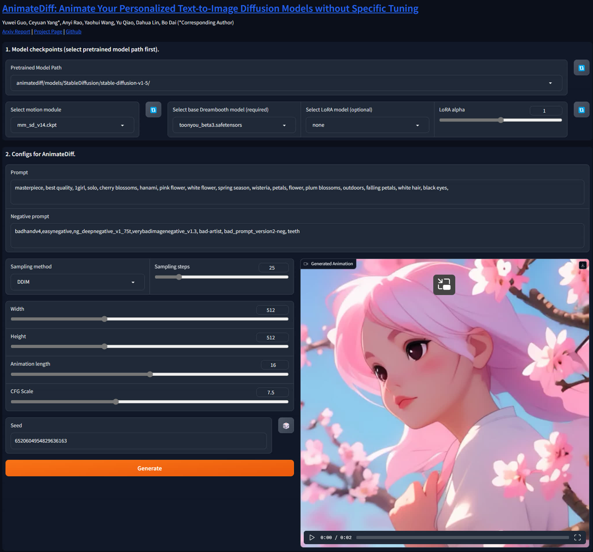


## Technical Explanation
<details close>
<summary>Technical Explanation</summary>

### AnimateDiff

**AnimateDiff aims to learn transferable motion priors that can be applied to other variants of Stable Diffusion family.**
To this end, we design the following training pipeline consisting of three stages.

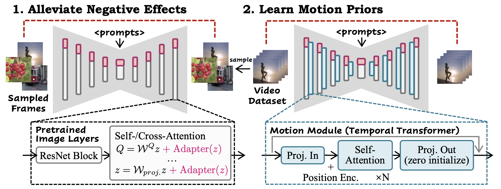

- In **1. Alleviate Negative Effects** stage, we train the **domain adapter**, e.g., `v3_sd15_adapter.ckpt`, to fit defective visual aritfacts (e.g., watermarks) in the training dataset.
This can also benefit the distangled learning of motion and spatial appearance.
By default, the adapter can be removed at inference. It can also be integrated into the model and its effects can be adjusted by a lora scaler.

- In **2. Learn Motion Priors** stage, we train the **motion module**, e.g., `v3_sd15_mm.ckpt`, to learn the real-world motion patterns from videos.

- In **3. (optional) Adapt to New Patterns** stage, we train **MotionLoRA**, e.g., `v2_lora_ZoomIn.ckpt`, to efficiently adapt motion module for specific motion patterns (camera zooming, rolling, etc.).

### SparseCtrl

**SparseCtrl aims to add more control to text-to-video models by adopting some sparse inputs (e.g., few RGB images or sketch inputs).**
Its technicall details can be found in the following paper:

**[SparseCtrl: Adding Sparse Controls to Text-to-Video Diffusion Models](https://arxiv.org/abs/2311.16933)**  
[Yuwei Guo](https://guoyww.github.io/),
[Ceyuan Yang✝](https://ceyuan.me/),
[Anyi Rao](https://anyirao.com/),
[Maneesh Agrawala](https://graphics.stanford.edu/~maneesh/),
[Dahua Lin](http://dahua.site),
[Bo Dai](https://daibo.info)
(✝Corresponding Author)  
[](https://arxiv.org/abs/2311.16933)
[](https://guoyww.github.io/projects/SparseCtrl/)

</details>


## Model Versions
<details close>
<summary>Model Versions</summary>

### AnimateDiff v3 and SparseCtrl (2023.12)

In this version, we use **Domain Adapter LoRA** for image model finetuning, which provides more flexiblity at inference.
We also implement two (RGB image/scribble) [SparseCtrl](https://arxiv.org/abs/2311.16933) encoders, which can take abitary number of condition maps to control the animation contents.

<details close>
<summary>AnimateDiff v3 Model Zoo</summary>

| Name | HuggingFace | Type | Storage | Description |
| - | - | - | - | - |
| `v3_adapter_sd_v15.ckpt` | [Link](https://huggingface.co/guoyww/animatediff/blob/main/v3_sd15_adapter.ckpt) | Domain Adapter | 97.4 MB | |
| `v3_sd15_mm.ckpt.ckpt` | [Link](https://huggingface.co/guoyww/animatediff/blob/main/v3_sd15_mm.ckpt) | Motion Module | 1.56 GB | |
| `v3_sd15_sparsectrl_scribble.ckpt` | [Link](https://huggingface.co/guoyww/animatediff/blob/main/v3_sd15_sparsectrl_scribble.ckpt) | SparseCtrl Encoder | 1.86 GB | scribble condition |
| `v3_sd15_sparsectrl_rgb.ckpt` | [Link](https://huggingface.co/guoyww/animatediff/blob/main/v3_sd15_sparsectrl_rgb.ckpt) | SparseCtrl Encoder | 1.85 GB | RGB image condition |
</details>

#### Limitations
1. Small fickering is noticable;
2. To stay compatible with comunity models, there is no specific optimizations for general T2V, leading to limited visual quality under this setting;
3. **(Style Alignment) For usage such as image animation/interpolation, it's recommanded to use images generated by the same community model.**

#### Demos
<table class="center">
    <tr style="line-height: 0">
    <td width=25% style="border: none; text-align: center">Input (by RealisticVision)</td>
    <td width=25% style="border: none; text-align: center">Animation</td>
    <td width=25% style="border: none; text-align: center">Input</td>
    <td width=25% style="border: none; text-align: center">Animation</td>
    </tr>
    <tr>
    <td width=25% style="border: none">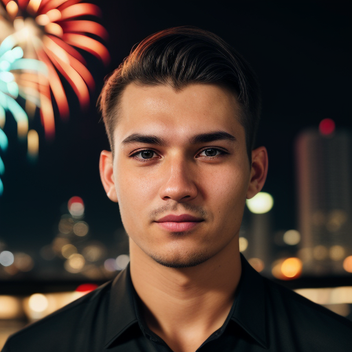</td>
    <td width=25% style="border: none">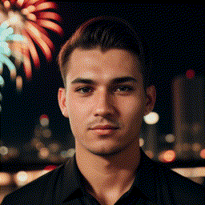</td>
    <td width=25% style="border: none"></td>
    <td width=25% style="border: none"></td>
    </tr>
</table>

<table class="center">
    <tr style="line-height: 0">
    <td width=25% style="border: none; text-align: center">Input Scribble</td>
    <td width=25% style="border: none; text-align: center">Output</td>
    <td width=25% style="border: none; text-align: center">Input Scribbles</td>
    <td width=25% style="border: none; text-align: center">Output</td>
    </tr>
    <tr>
      <td width=25% style="border: none">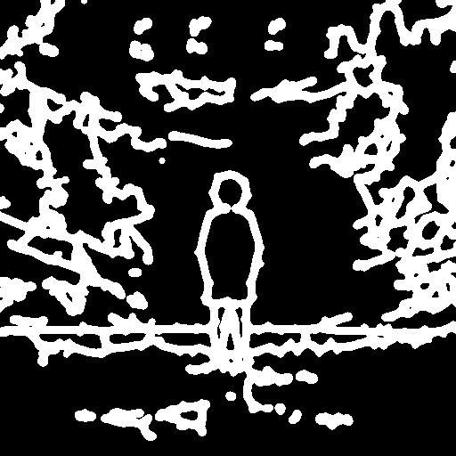</td>
      <td width=25% style="border: none"></td>
      <td width=25% style="border: none">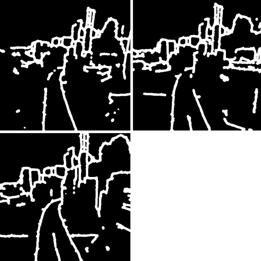</td>
      <td width=25% style="border: none">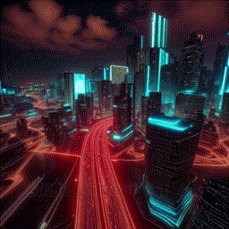</td>
    </tr>
</table>


### AnimateDiff SDXL-Beta (2023.11)

Release the Motion Module (beta version) on SDXL, available at [Google Drive](https://drive.google.com/file/d/1EK_D9hDOPfJdK4z8YDB8JYvPracNx2SX/view?usp=share_link
) / [HuggingFace](https://huggingface.co/guoyww/animatediff/blob/main/mm_sdxl_v10_beta.ckpt
) / [CivitAI](https://civitai.com/models/108836/animatediff-motion-modules). High resolution videos (i.e., 1024x1024x16 frames with various aspect ratios) could be produced **with/without** personalized models. Inference usually requires ~13GB VRAM and tuned hyperparameters (e.g., sampling steps), depending on the chosen personalized models.  
Checkout to the branch [sdxl](https://github.com/guoyww/AnimateDiff/tree/sdxl) for more details of the inference.

<details close>
<summary>AnimateDiff SDXL-Beta Model Zoo</summary>

| Name | HuggingFace | Type | Storage Space |
| - | - | - | - |
| `mm_sdxl_v10_beta.ckpt` | [Link](https://huggingface.co/guoyww/animatediff/blob/main/mm_sdxl_v10_beta.ckpt) | Motion Module | 950 MB |
</details>

#### Demos
<table class="center">
    <tr style="line-height: 0">
    <td width=52% style="border: none; text-align: center">Original SDXL</td>
    <td width=30% style="border: none; text-align: center">Community SDXL</td>
    <td width=18% style="border: none; text-align: center">Community SDXL</td>
    </tr>
    <tr>
    <td width=52% style="border: none">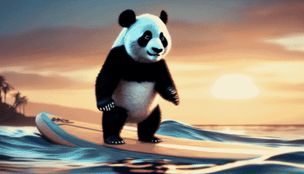</td>
    <td width=30% style="border: none"></td>
    <td width=18% style="border: none">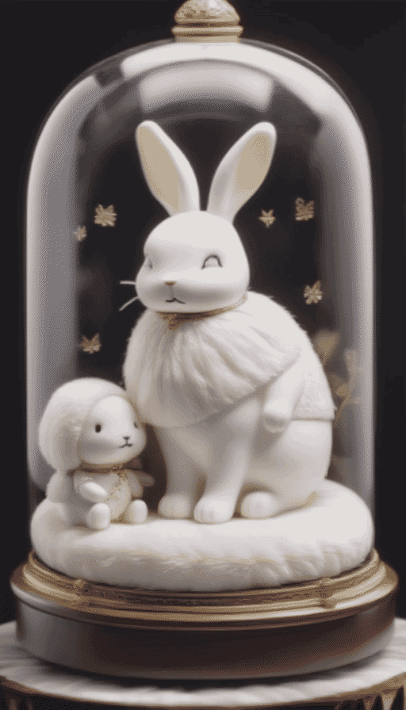</td>
    </tr>
</table>


### AnimateDiff v2 (2023.09)

In this version, the motion module `mm_sd_v15_v2.ckpt` ([Google Drive](https://drive.google.com/drive/folders/1EqLC65eR1-W-sGD0Im7fkED6c8GkiNFI?usp=sharing) / [HuggingFace](https://huggingface.co/guoyww/animatediff) / [CivitAI](https://civitai.com/models/108836/animatediff-motion-modules)) is trained upon larger resolution and batch size.
We found that the scale-up training significantly helps improve the motion quality and diversity.  
We also support **MotionLoRA** of eight basic camera movements.
MotionLoRA checkpoints take up only **77 MB storage per model**, and are available at [Google Drive](https://drive.google.com/drive/folders/1EqLC65eR1-W-sGD0Im7fkED6c8GkiNFI?usp=sharing) / [HuggingFace](https://huggingface.co/guoyww/animatediff) / [CivitAI](https://civitai.com/models/108836/animatediff-motion-modules).

<details close>
<summary>AnimateDiff v2 Model Zoo</summary>

| Name | HuggingFace | Type | Parameter | Storage |
| - | - | - | - | - |
| `mm_sd_v15_v2.ckpt` | [Link](https://huggingface.co/guoyww/animatediff/blob/main/mm_sd_v15_v2.ckpt) | Motion Module | 453 M | 1.7 GB |
| `v2_lora_ZoomIn.ckpt` | [Link](https://huggingface.co/guoyww/animatediff/blob/main/v2_lora_ZoomIn.ckpt) | MotionLoRA | 19 M | 74 MB |
| `v2_lora_ZoomOut.ckpt` | [Link](https://huggingface.co/guoyww/animatediff/blob/main/v2_lora_ZoomOut.ckpt) | MotionLoRA | 19 M | 74 MB |
| `v2_lora_PanLeft.ckpt` | [Link](https://huggingface.co/guoyww/animatediff/blob/main/v2_lora_PanLeft.ckpt) | MotionLoRA | 19 M | 74 MB |
| `v2_lora_PanRight.ckpt` | [Link](https://huggingface.co/guoyww/animatediff/blob/main/v2_lora_PanRight.ckpt) | MotionLoRA | 19 M | 74 MB |
| `v2_lora_TiltUp.ckpt` | [Link](https://huggingface.co/guoyww/animatediff/blob/main/v2_lora_TiltUp.ckpt) | MotionLoRA | 19 M | 74 MB |
| `v2_lora_TiltDown.ckpt` | [Link](https://huggingface.co/guoyww/animatediff/blob/main/v2_lora_TiltDown.ckpt) | MotionLoRA | 19 M | 74 MB |
| `v2_lora_RollingClockwise.ckpt` | [Link](https://huggingface.co/guoyww/animatediff/blob/main/v2_lora_RollingClockwise.ckpt) | MotionLoRA | 19 M | 74 MB |
| `v2_lora_RollingAnticlockwise.ckpt` | [Link](https://huggingface.co/guoyww/animatediff/blob/main/v2_lora_RollingAnticlockwise.ckpt) | MotionLoRA | 19 M | 74 MB |
</details>


#### Demos (MotionLoRA)
<table class="center">
  <tr style="line-height: 0">
    <td colspan="2" style="border: none; text-align: center">Zoom In</td>
    <td colspan="2" style="border: none; text-align: center">Zoom Out</td>
    <td colspan="2" style="border: none; text-align: center">Zoom Pan Left</td>
    <td colspan="2" style="border: none; text-align: center">Zoom Pan Right</td>
  </tr>
  <tr>
    <td style="border: none">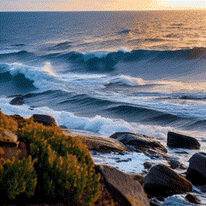</td>
    <td style="border: none">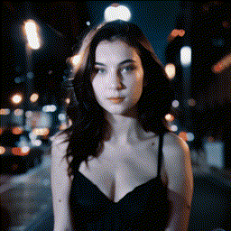</td>
    <td style="border: none">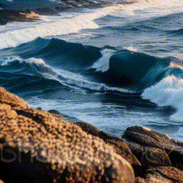</td>
    <td style="border: none">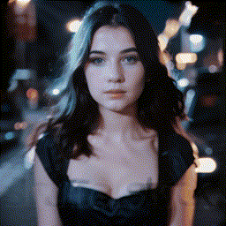</td>
    <td style="border: none">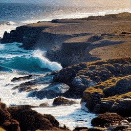</td>
    <td style="border: none">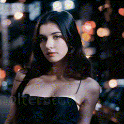</td>
    <td style="border: none"></td>
    <td style="border: none">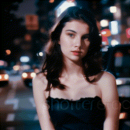</td>
  </tr>
  <tr style="line-height: 0">
    <td colspan="2" style="border: none; text-align: center">Tilt Up</td>
    <td colspan="2" style="border: none; text-align: center">Tilt Down</td>
    <td colspan="2" style="border: none; text-align: center">Rolling Anti-Clockwise</td>
    <td colspan="2" style="border: none; text-align: center">Rolling Clockwise</td>
  </tr>
  <tr>
    <td style="border: none">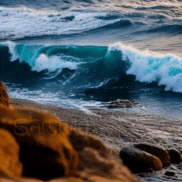</td>
    <td style="border: none">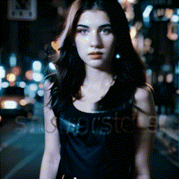</td>
    <td style="border: none">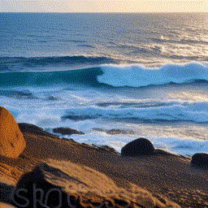</td>
    <td style="border: none">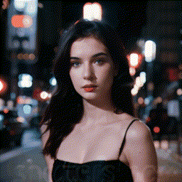</td>
    <td style="border: none">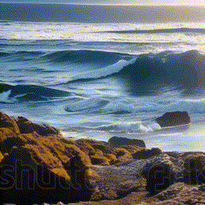</td>
    <td style="border: none">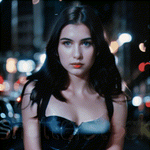</td>
    <td style="border: none">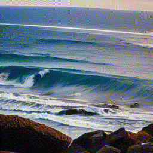</td>
    <td style="border: none">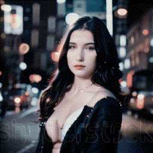</td>
  </tr>
</table>


#### Demos (Improved Motions)
Here's a comparison between `mm_sd_v15.ckpt` (left) and improved `mm_sd_v15_v2.ckpt` (right).

<table class="center">
  <tr>
    <td></td>
    <td></td>
    <td></td>
    <td></td>
    <td>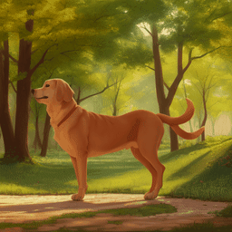</td>
    <td>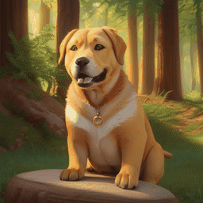</td>
    <td>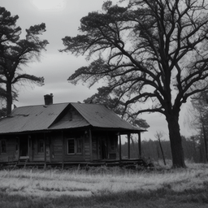</td>
    <td>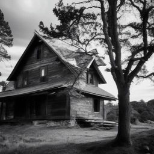</td>
  </tr>
</table>


### AnimateDiff v1 (2023.07)

The first version of AnimateDiff!

<details close>
<summary>AnimateDiff v1 Model Zoo</summary>

| Name | HuggingFace | Parameter | Storage Space |
| - | - | - | - |
| mm_sd_v14.ckpt | [Link](https://huggingface.co/guoyww/animatediff/blob/main/mm_sd_v14.ckpt) | 417 M | 1.6 GB |
| mm_sd_v15.ckpt | [Link](https://huggingface.co/guoyww/animatediff/blob/main/mm_sd_v15.ckpt) | 417 M | 1.6 GB |
</details>

</details>


## Training
Please check [Steps for Training](__assets__/docs/animatediff.md) for details.


## Related Resources

AnimateDiff for Stable Diffusion WebUI: [sd-webui-animatediff](https://github.com/continue-revolution/sd-webui-animatediff) (by [@continue-revolution](https://github.com/continue-revolution))  
AnimateDiff for ComfyUI: [ComfyUI-AnimateDiff-Evolved](https://github.com/Kosinkadink/ComfyUI-AnimateDiff-Evolved) (by [@Kosinkadink](https://github.com/Kosinkadink))  
Google Colab: [Colab](https://colab.research.google.com/github/camenduru/AnimateDiff-colab/blob/main/AnimateDiff_colab.ipynb) (by [@camenduru](https://github.com/camenduru))


## Disclaimer
This project is released for academic use.
We disclaim responsibility for user-generated content.
Also, please be advised that our only official website are https://github.com/guoyww/AnimateDiff and https://animatediff.github.io, and all the other websites are NOT associated with us at AnimateDiff. 


## Contact Us
Yuwei Guo: [guoyw@ie.cuhk.edu.hk](mailto:guoyw@ie.cuhk.edu.hk)  
Ceyuan Yang: [limbo0066@gmail.com](mailto:limbo0066@gmail.com)  
Bo Dai: [doubledaibo@gmail.com](mailto:doubledaibo@gmail.com)


## BibTeX
```
@article{guo2023animatediff,
  title={AnimateDiff: Animate Your Personalized Text-to-Image Diffusion Models without Specific Tuning},
  author={Guo, Yuwei and Yang, Ceyuan and Rao, Anyi and Liang, Zhengyang and Wang, Yaohui and Qiao, Yu and Agrawala, Maneesh and Lin, Dahua and Dai, Bo},
  journal={International Conference on Learning Representations},
  year={2024}
}

@article{guo2023sparsectrl,
  title={SparseCtrl: Adding Sparse Controls to Text-to-Video Diffusion Models},
  author={Guo, Yuwei and Yang, Ceyuan and Rao, Anyi and Agrawala, Maneesh and Lin, Dahua and Dai, Bo},
  journal={arXiv preprint arXiv:2311.16933},
  year={2023}
}
```


## Acknowledgements
Codebase built upon [Tune-a-Video](https://github.com/showlab/Tune-A-Video).
