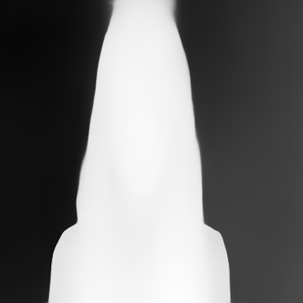
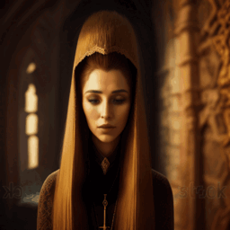
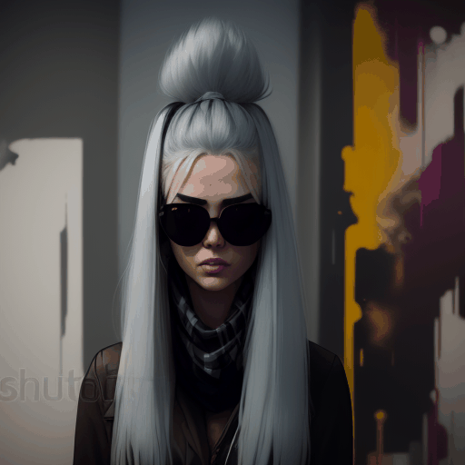
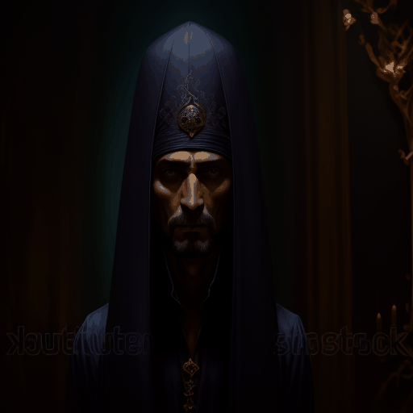
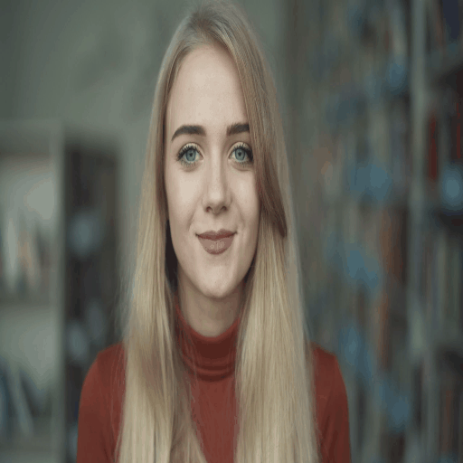
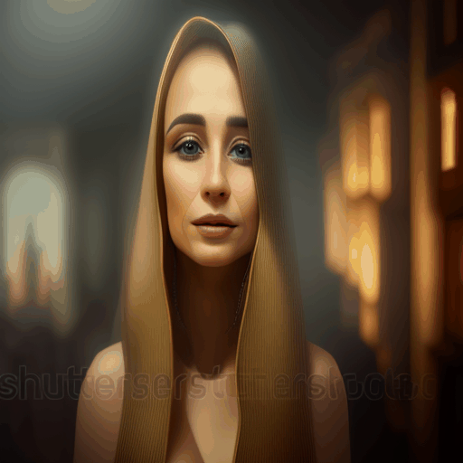
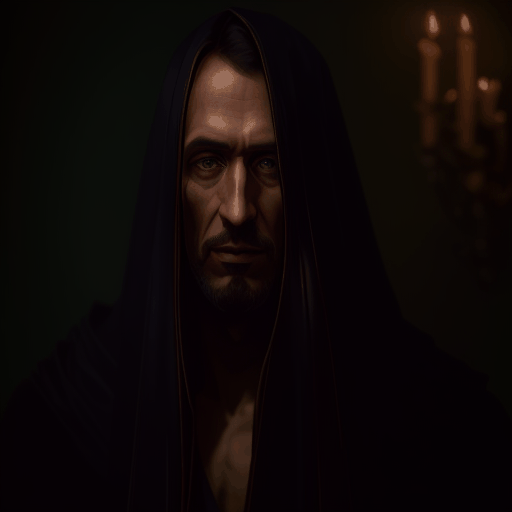
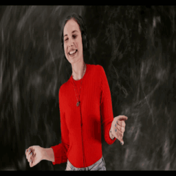
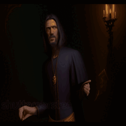

# Controled AnimateDiff

This repository is an <b>extension</b> of the official implementation of [AnimateDiff](https://arxiv.org/abs/2307.04725).

**[AnimateDiff: Animate Your Personalized Text-to-Image Diffusion Models without Specific Tuning](https://arxiv.org/abs/2307.04725)**
</br>
Yuwei Guo,
Ceyuan Yang*,
Anyi Rao,
Yaohui Wang,
Yu Qiao,
Dahua Lin,
Bo Dai
<p style="font-size: 0.8em; margin-top: -1em">*Corresponding Author</p>

<!-- [Arxiv Report](https://arxiv.org/abs/2307.04725) | [Project Page](https://animatediff.github.io/) -->
[](https://arxiv.org/abs/2307.04725)
[](https://animatediff.github.io/)
[](https://openxlab.org.cn/apps/detail/Masbfca/AnimateDiff)
[](https://huggingface.co/spaces/guoyww/AnimateDiff)

```
WARNING! This version is not compatible with the official implementation due to the difference in library versions.
```

<table width="1200" class="center">
    <tr>
    <td></td>
    <td></td>
    <td></td>
    <td></td>
    <td></td>
    </tr>
</table>  
<table width="1200" class="center">
    <tr>
    <td></td>
    <td></td>
    <td></td>
    <td></td>
    </tr>
</table>  
<details>
<summary>More controlnet examples</summary>
<table width="1200" class="center">
    <tr>
    <td></td>
    <td></td>
    <td></td>
    <td></td>
    </tr>
</table>  
</details>
Test video sources: <a href="https://stable-diffusion-art.com/video-to-video/">dance</a> and <a href="https://mixkit.co/free-stock-video/girl-smiling-portrait-in-the-library-4756/">smiling</a>.  

## Features
- Added Controlnet for Video to Video control.
- GPU Memory, ~14GB VRAM to inference w/o Controlnet and ~17GB VRAM with Controlnet.
- User Interface: [Gradio](#gradio-demo), A1111 WebUI Extension [sd-webui-animatediff](https://github.com/continue-revolution/sd-webui-animatediff) (by [@continue-revolution](https://github.com/continue-revolution))
- Google Colab: [Colab](https://colab.research.google.com/github/camenduru/AnimateDiff-colab/blob/main/AnimateDiff_colab.ipynb) (by [@camenduru](https://github.com/camenduru))

## Common Issues
<details>
<summary>Installation</summary>

Please ensure the installation of [xformer](https://github.com/facebookresearch/xformers) that is applied to reduce the inference memory.
</details>


<details>
<summary>Various resolution or number of frames</summary>
Currently, we recommend users to generate animation with 16 frames and 512 resolution that are aligned with our training settings. Notably, various resolution/frames may affect the quality more or less. 
</details>


<details>
<summary>How to use it without any coding</summary>

1) Get lora models: train lora model with [A1111](https://github.com/continue-revolution/sd-webui-animatediff) based on a collection of your own favorite images (e.g., tutorials [English](https://www.youtube.com/watch?v=mfaqqL5yOO4), [Japanese](https://www.youtube.com/watch?v=N1tXVR9lplM), [Chinese](https://www.bilibili.com/video/BV1fs4y1x7p2/)) 
or download Lora models from [Civitai](https://civitai.com/).

2) Animate lora models: using gradio interface or A1111 
(e.g., tutorials [English](https://github.com/continue-revolution/sd-webui-animatediff), [Japanese](https://www.youtube.com/watch?v=zss3xbtvOWw), [Chinese](https://941ai.com/sd-animatediff-webui-1203.html)) 

3) Be creative togther with other techniques, such as, super resolution, frame interpolation, music generation, etc.
</details>


<details>
<summary>Animating a given image</summary>

We totally agree that animating a given image is an appealing feature, which we would try to support officially in future. For now, you may enjoy other efforts from the [talesofai](https://github.com/talesofai/AnimateDiff).  
</details>

<details>
<summary>Contributions from community</summary>
Contributions are always welcome!! The <code>dev</code> branch is for community contributions. As for the main branch, we would like to align it with the original technical report :)
</details>


## Setups for Inference

### Prepare Environment

***We updated our inference code with xformers and a sequential decoding trick. Now AnimateDiff takes only ~12GB VRAM to inference, and run on a single RTX3090 !!***

```
git clone https://github.com/guoyww/AnimateDiff.git
cd AnimateDiff

conda env create -f environment.yaml
conda activate animatediff
```

### Download Base T2I & Motion Module Checkpoints
We provide two versions of our Motion Module, which are trained on stable-diffusion-v1-4 and finetuned on v1-5 seperately.
It's recommanded to try both of them for best results.
```
git lfs install
git clone https://huggingface.co/runwayml/stable-diffusion-v1-5 models/StableDiffusion/

bash download_bashscripts/0-MotionModule.sh
```
You may also directly download the motion module checkpoints from [Google Drive](https://drive.google.com/drive/folders/1EqLC65eR1-W-sGD0Im7fkED6c8GkiNFI?usp=sharing) / [HuggingFace](https://huggingface.co/guoyww/animatediff) / [CivitAI](https://civitai.com/models/108836), then put them in `models/Motion_Module/` folder.

### Prepare Personalize T2I
Here we provide inference configs for 6 demo T2I on CivitAI.
You may run the following bash scripts to download these checkpoints.
```
bash download_bashscripts/1-ToonYou.sh
bash download_bashscripts/2-Lyriel.sh
bash download_bashscripts/3-RcnzCartoon.sh
bash download_bashscripts/4-MajicMix.sh
bash download_bashscripts/5-RealisticVision.sh
bash download_bashscripts/6-Tusun.sh
bash download_bashscripts/7-FilmVelvia.sh
bash download_bashscripts/8-GhibliBackground.sh
```

### Inference
After downloading the above peronalized T2I checkpoints, run the following commands to generate animations. The results will automatically be saved to `samples/` folder.
```
python -m scripts.animate --config configs/prompts/1-ToonYou.yaml
python -m scripts.animate --config configs/prompts/2-Lyriel.yaml
python -m scripts.animate --config configs/prompts/3-RcnzCartoon.yaml
python -m scripts.animate --config configs/prompts/4-MajicMix.yaml
python -m scripts.animate --config configs/prompts/5-RealisticVision.yaml
python -m scripts.animate --config configs/prompts/6-Tusun.yaml
python -m scripts.animate --config configs/prompts/7-FilmVelvia.yaml
python -m scripts.animate --config configs/prompts/8-GhibliBackground.yaml
```

To generate animations with a new DreamBooth/LoRA model, you may create a new config `.yaml` file in the following format:
```
NewModel:
  path: "[path to your DreamBooth/LoRA model .safetensors file]"
  base: "[path to LoRA base model .safetensors file, leave it empty string if not needed]"

  motion_module:
    - "models/Motion_Module/mm_sd_v14.ckpt"
    - "models/Motion_Module/mm_sd_v15.ckpt"
    
  steps:          25
  guidance_scale: 7.5

  prompt:
    - "[positive prompt]"

  n_prompt:
    - "[negative prompt]"
```
Then run the following commands:
```
python -m scripts.animate --config [path to the config file]
```
## Inference with Controlnet
Controlnet appoach is using video as source of content. It takes first `L` (usualy 16) frames from video. 

Download controlnet models using script:
```bash
bash download_bashscripts/9-Controlnets.sh
```  

Run examples:
```bash
python -m scripts.animate --config configs/prompts/1-ToonYou-Controlnet.yaml
python -m scripts.animate --config configs/prompts/2-Lyriel-Controlnet.yaml
python -m scripts.animate --config configs/prompts/3-RcnzCartoon-Controlnet.yaml
```

Add controlnet to other config (see example in 1-ToonYou-Controlnet.yaml):
```yaml
control:
  video_path: "./videos/smiling.mp4"
  get_each: 2 # get each frame from video
  controlnet_processor: "softedge" # softedge, canny, depth
  controlnet_pipeline: "models/StableDiffusion/stable-diffusion-v1-5"
  controlnet_processor_path: "models/Controlnet/control_v11p_sd15_softedge" # control_v11p_sd15_softedge, control_v11f1p_sd15_depth, control_v11p_sd15_canny
  guess_mode: True
```

## Steps for Training

### Dataset
Before training, download the videos files and the `.csv` annotations of [WebVid10M](https://maxbain.com/webvid-dataset/) to the local mechine.
Note that our examplar training script requires all the videos to be saved in a single folder. You may change this by modifying `animatediff/data/dataset.py`.

### Configuration
After dataset preparations, update the below data paths in the config `.yaml` files in `configs/training/` folder:
```
train_data:
  csv_path:     [Replace with .csv Annotation File Path]
  video_folder: [Replace with Video Folder Path]
  sample_size:  256
```
Other training parameters (lr, epochs, validation settings, etc.) are also included in the config files.

### Training
To train motion modules
```
torchrun --nnodes=1 --nproc_per_node=1 train.py --config configs/training/training.yaml
```

To finetune the unet's image layers
```
torchrun --nnodes=1 --nproc_per_node=1 train.py --config configs/training/image_finetune.yaml
```


## Gradio Demo
We have created a Gradio demo to make AnimateDiff easier to use. To launch the demo, please run the following commands:
```
conda activate animatediff
python app.py
```
By default, the demo will run at `localhost:7860`.
<br>

## Gallery
Here we demonstrate several best results we found in our experiments.

<table class="center">
    <tr>
    <td></td>
    <td></td>
    <td></td>
    <td></td>
    </tr>
</table>
<p style="margin-left: 2em; margin-top: -1em">Model：<a href="https://civitai.com/models/30240/toonyou">ToonYou</a></p>

<table>
    <tr>
    <td></td>
    <td></td>
    <td></td>
    <td></td>
    </tr>
</table>
<p style="margin-left: 2em; margin-top: -1em">Model：<a href="https://civitai.com/models/4468/counterfeit-v30">Counterfeit V3.0</a></p>

<table>
    <tr>
    <td></td>
    <td></td>
    <td></td>
    <td></td>
    </tr>
</table>
<p style="margin-left: 2em; margin-top: -1em">Model：<a href="https://civitai.com/models/4201/realistic-vision-v20">Realistic Vision V2.0</a></p>

<table>
    <tr>
    <td></td>
    <td></td>
    <td></td>
    <td></td>
    </tr>
</table>
<p style="margin-left: 2em; margin-top: -1em">Model： <a href="https://civitai.com/models/43331/majicmix-realistic">majicMIX Realistic</a></p>

<table>
    <tr>
    <td></td>
    <td></td>
    <td></td>
    <td></td>
    </tr>
</table>
<p style="margin-left: 2em; margin-top: -1em">Model：<a href="https://civitai.com/models/66347/rcnz-cartoon-3d">RCNZ Cartoon</a></p>

<table>
    <tr>
    <td></td>
    <td></td>
    <td></td>
    <td></td>
    </tr>
</table>
<p style="margin-left: 2em; margin-top: -1em">Model：<a href="https://civitai.com/models/33208/filmgirl-film-grain-lora-and-loha">FilmVelvia</a></p>

#### Community Cases
Here are some samples contributed by the community artists. Create a Pull Request if you would like to show your results here😚.

<table>
    <tr>
    <td></td>
    <td></td>
    <td></td>
    <td></td>
    <td></td>
    </tr>
</table>
<p style="margin-left: 2em; margin-top: -1em">
Character Model：<a href="https://civitai.com/models/13237/genshen-impact-yoimiya">Yoimiya</a> 
(with an initial reference image, see <a href="https://github.com/talesofai/AnimateDiff">WIP fork</a> for the extended implementation.)


<table>
    <tr>
    <td></td>
    <td></td>
    <td></td>
    <td></td>
    </tr>
</table>
<p style="margin-left: 2em; margin-top: -1em">
Character Model：<a href="https://civitai.com/models/9850/paimon-genshin-impact">Paimon</a>;
Pose Model：<a href="https://civitai.com/models/107295/or-holdingsign">Hold Sign</a></p>

## BibTeX
```
@article{guo2023animatediff,
  title={AnimateDiff: Animate Your Personalized Text-to-Image Diffusion Models without Specific Tuning},
  author={Guo, Yuwei and Yang, Ceyuan and Rao, Anyi and Wang, Yaohui and Qiao, Yu and Lin, Dahua and Dai, Bo},
  journal={arXiv preprint arXiv:2307.04725},
  year={2023}
}
```

## Contact Us
**Yuwei Guo**: [guoyuwei@pjlab.org.cn](mailto:guoyuwei@pjlab.org.cn)  
**Ceyuan Yang**: [yangceyuan@pjlab.org.cn](mailto:yangceyuan@pjlab.org.cn)  
**Bo Dai**: [daibo@pjlab.org.cn](mailto:daibo@pjlab.org.cn)

## Acknowledgements
Codebase built upon [Tune-a-Video](https://github.com/showlab/Tune-A-Video).