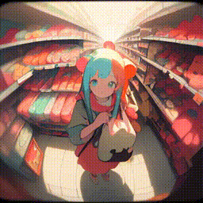
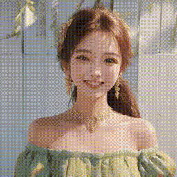
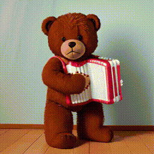
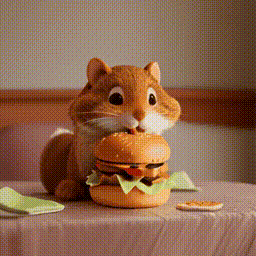
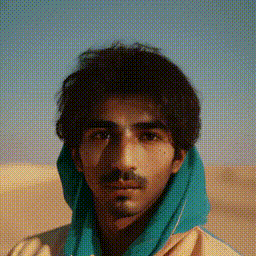
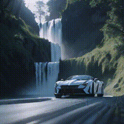
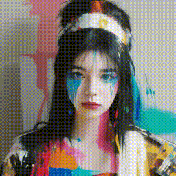
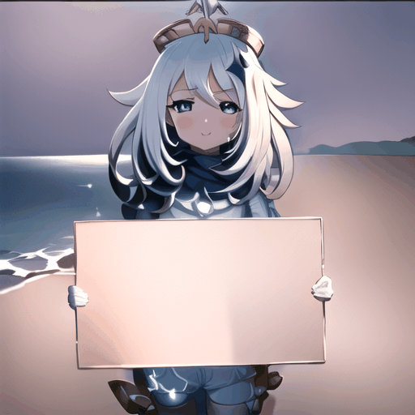
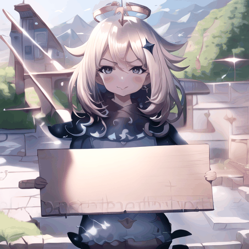

# Gallery
Here we demonstrate several best results we found in our experiments.

<table class="center">
    <tr>
    <td></td>
    <td></td>
    <td></td>
    <td></td>
    </tr>
</table>

Model：<a href="https://civitai.com/models/30240/toonyou">ToonYou</a>

<table>
    <tr>
    <td></td>
    <td></td>
    <td></td>
    <td></td>
    </tr>
</table>

Model：<a href="https://civitai.com/models/4468/counterfeit-v30">Counterfeit V3.0</a>

<table>
    <tr>
    <td></td>
    <td></td>
    <td></td>
    <td></td>
    </tr>
</table>

Model：<a href="https://civitai.com/models/4201/realistic-vision-v20">Realistic Vision V2.0</a>

<table>
    <tr>
    <td></td>
    <td></td>
    <td></td>
    <td></td>
    </tr>
</table>

Model： <a href="https://civitai.com/models/43331/majicmix-realistic">majicMIX Realistic</a>

<table>
    <tr>
    <td></td>
    <td></td>
    <td></td>
    <td></td>
    </tr>
</table>

Model：<a href="https://civitai.com/models/66347/rcnz-cartoon-3d">RCNZ Cartoon</a>

<table>
    <tr>
    <td></td>
    <td></td>
    <td></td>
    <td></td>
    </tr>
</table>

Model：<a href="https://civitai.com/models/33208/filmgirl-film-grain-lora-and-loha">FilmVelvia</a>

#### Community Cases
Here are some samples contributed by the community artists. Create a Pull Request if you would like to show your results here😚.

<table>
    <tr>
    <td></td>
    <td></td>
    <td></td>
    <td></td>
    <td></td>
    </tr>
</table>

Character Model：<a href="https://civitai.com/models/13237/genshen-impact-yoimiya">Yoimiya</a> 
(with an initial reference image, see <a href="https://github.com/talesofai/AnimateDiff">WIP fork</a> for the extended implementation.)

<table>
    <tr>
    <td></td>
    <td></td>
    <td></td>
    <td></td>
    </tr>
</table>

Character Model：<a href="https://civitai.com/models/9850/paimon-genshin-impact">Paimon</a>;
Pose Model：<a href="https://civitai.com/models/107295/or-holdingsign">Hold Sign</a>

